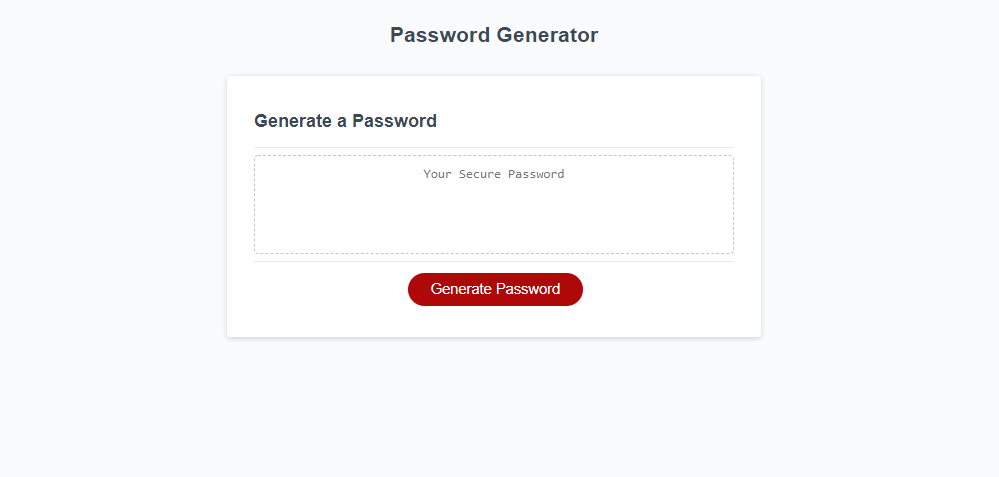
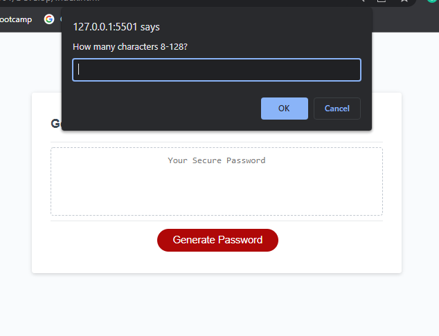

## Password-Gen
# Base Site

#
This is a password generator made to give you the option to generate a password made of letters, capital letters, numbers, and/or special characters. It can be set from 8-128 characters. user input is given 
through answering prompt messages.
#
# Prompt example

#
# Link
https://jschuyl.github.io/Password-Gen/
